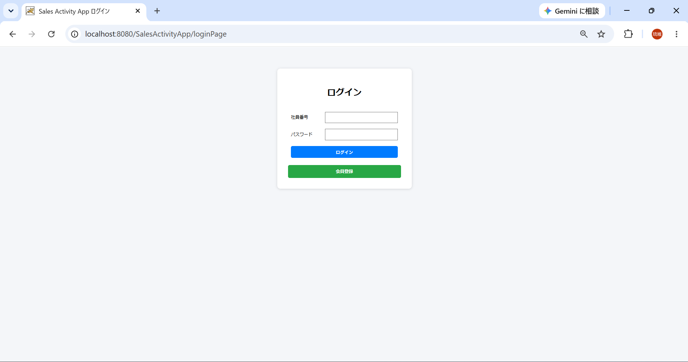
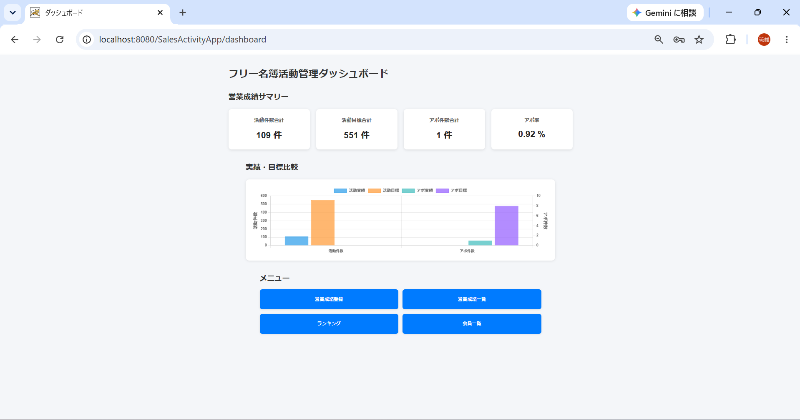
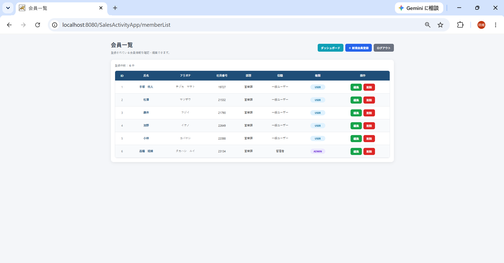
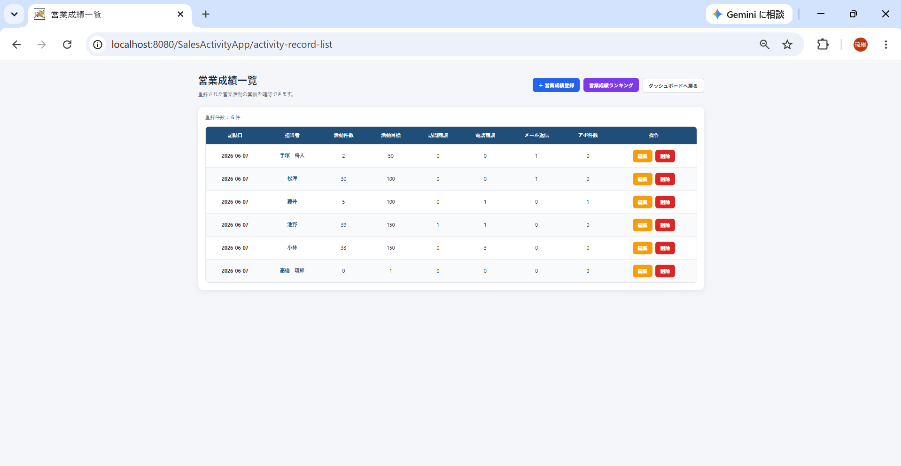
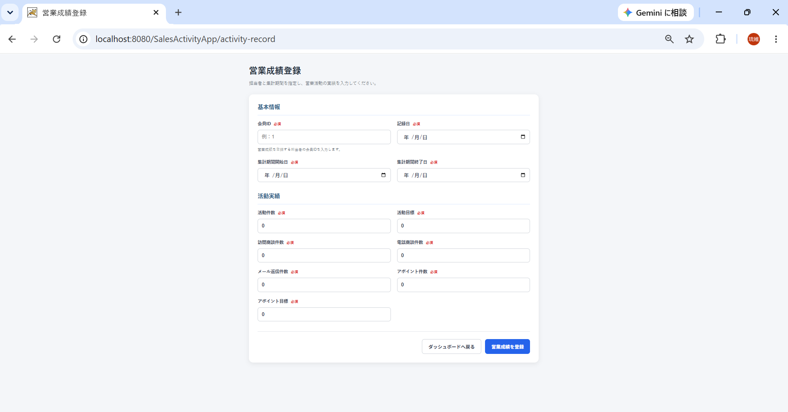
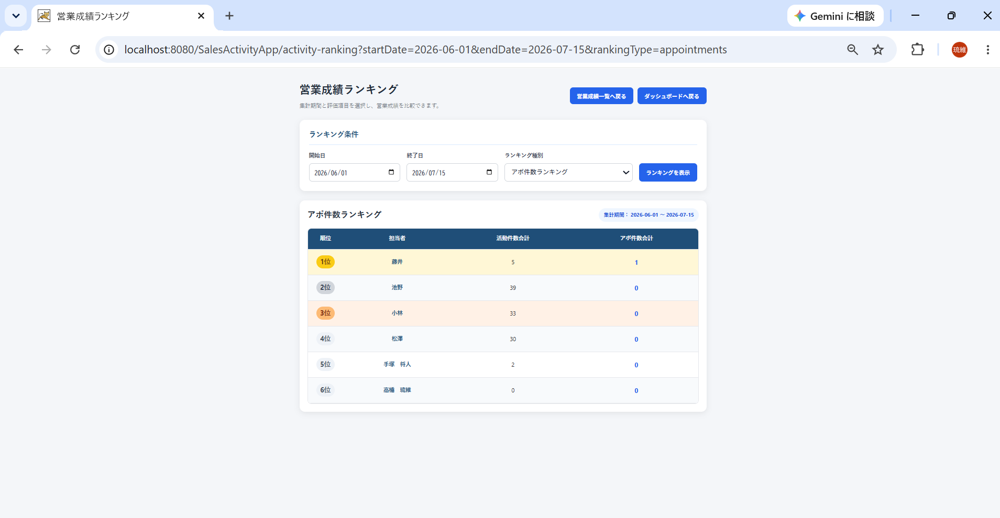

# フリー名簿活動管理システム（Sales Activity Management System）

## アプリ概要

営業担当者の営業活動を一元管理するWebアプリケーションです。

営業成績の登録・編集・削除、ランキング表示、会員管理などを行うことができます。

本アプリはJava(Servlet/JSP)を用いて開発し、転職活動用ポートフォリオとして制作しました。

---

## 開発目的

住宅営業活動の一環として、過去に来場されたお客様に電話をおかけしたり、資料請求してくださったお客様のもとに訪問営業をすることがありました。
その活動の中で、移動先で活動結果を入力することができるアプリが必要であると考え開発に至りました。このアプリケーションが実現できることとしては
以下の三つが挙げられます。

- 活動の記録
- 営業成績の管理
- 成績の比較によるモチベーションアップ
- アポイントメント取得率の見える化によりどの担当者の活動方法が効果的かを明確にする。

---

## 主な機能

### ログイン

- ログイン認証
- ログアウト
- セッション管理
- キャッシュ対策

---

### ダッシュボード

- 営業成績サマリー表示
- グラフ表示
- 各画面へのメニュー

---

### 会員管理

- 会員一覧
- 新規会員登録
- 会員編集
- 会員削除

---

### 営業成績管理

- 営業成績登録
- 営業成績一覧
- 営業成績編集
- 営業成績削除

---

### ランキング

期間を指定して

- アポ件数ランキング
- アポ率ランキング
- 訪問件数ランキング
- 電話件数ランキング
- メール件数ランキング

を表示できます。

---

## 使用技術

### フロントエンド

- HTML
- CSS
- JavaScript

### バックエンド

- Java
- Servlet (javax.servlet)
- JSP
- JDBC

### データベース

- MariaDB
- phpMyAdmin

### 開発環境

- Eclipse (Pleiades)
- Apache Tomcat 9
- Git
- GitHub

---

## データベース

主なテーブル

- users
- members
- activity_records

---

## 主な画面

- ログイン画面
- ダッシュボード
- 会員一覧
- 会員登録
- 会員編集
- 営業成績一覧
- 営業成績登録
- 営業成績編集
- 営業成績ランキング

---

## 工夫した点

- スマートフォンでも利用できるレスポンシブデザイン
- 表が増えても見やすいスクロールテーブル
- ランキング機能を実装
- ダッシュボードから各画面へ遷移できるUI
- 操作しやすい統一感のあるデザイン

---

## 今後追加したい機能

- CSV入出力
- 会員検索
- 営業成績検索
- 月別・年度別集計
- グラフ機能の強化
- Spring Bootへの移行

---

## 開発者

GitHub Portfolio

作成者：高橋 琉維
